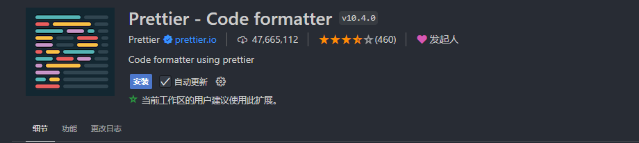

# 代码规范

## 1.1集成editorconfig配置

EditorConfig 有助于为不同 IDE 编辑器上处理同一项目的多个开发人员维护一致的编码风格。

```
# EditorConfig 是一个文件格式，用于定义和维护跨编辑器的编码样式
# http://editorconfig.org
root = true

# 适用于所有文件
[*]
charset = utf-8 #设置文件字符集为 utf-8
indent_style = space #缩进风格(tab | space)
indent_size = 2 #缩进大小
end_of_line = lf #控制换行类型(lf|cr |crlf)
tab_width = 2 #定义用于表示制表符的列数的整数
trim_trailing_whitespace = true # 去除行尾的任意空白字符
insert_final_newline = true # 始终在文件末尾插入一个新行

# 适用于所有 Markdown 文件
[*.md]
indent_size = 4
max_line_length = off
trim_trailing_whitespace = false

# 适用于 JavaScript 文件
[*.js]
indent_size = 2

# 适用于 JSON 文件
[*.json]
indent_size = 2

# 适用于 TypeScript 文件
[*.ts]
indent_size = 2

# 适用于 HTML 文件
[*.html]
indent_size = 2
# 适用于 CSS 文件
[*.css]
indent_size = 2

```

vscode插件


## 1.2使用prettier工具

Prettier 是一款强大的代码格式化工具，支持JavaScript、TypeScript、CSS、SCSS、Less、JSX、Angular、Vue、GraphQL、JSON、Markdown 等语言，基本上前端能用到的文件格式它都可以搞定，是当下最流行的代码格式化工具。

### 1.安装prettier

```
npm install prettier -D
```

### 2.配置.prettierrc文件:

- printWidth:当行字符的长度，推荐80，也有人喜欢100或者120:
- tabWidth:tab是空格的情况下，是几个空格，选择2个:
- useTabs:使用tab缩进还是空格缩进，选择false;
- semi:语句末尾是否要加分号，默认值true，选择false表示不加;
- singleQuote:使用单引号还是双引号，选择true，使用单引号:
- trailingComma:在多行输入的尾逗号是否添加，设置为 none，比如对象类型的最后一个属性后面是否加一个"，":
  - 可选值：
    - `"none"`: 不添加结尾逗号
    - `"es5"`: 只在 ES5 兼容的地方添加（如对象和数组）
    - `"all"`: 在所有可能的地方添加结尾逗号
- bracketSpacing:决定对象字面量的大括号内是否添加空格
- jsxBracketSameLine:在 JSX 中，决定 `>` 是否在最后一行的末尾而不是另起一行。
- arrowParens:决定在箭头函数中是否强制使用括号。
  - 可选值：
    - `"always"`: 总是使用括号
    - `"avoid"`: 只有在必要时使用括号
- endOfLine:决定行结束符的类型。
  - 可选值：
    - `"auto"`: 自动检测
    - `"lf"`: 仅使用换行符（Unix 风格）
    - `"crlf"`: 使用回车和换行符（Windows 风格）
    - `"cr"`: 仅使用回车符

```
{
  "printWidth": 80,
  "tabWidth": 2,
  "useTabs": false,
  "semi": true,
  "singleQuote": true,
  "trailingComma": "es5",
  "bracketSpacing": true,
  "jsxBracketSameLine": false,
  "arrowParens": "always",
  "endOfLine": "lf"
}
```

### 3.创建.prettierignore忽略文件

```
# 忽略所有的构建目录
build/

# 忽略特定文件
src/old-code.js

# 忽略所有的 Markdown 文件
*.md

# 忽略特定的子目录
node_modules/

#项目所需
/dist/*
.loacl
.output.js
/node_modules/**

**/*.svg
**/*.sh
/public/*

```

### 4.vscode安装插件



### 5.测试prettier是否生效

- 测试一:在代码中保存代码;
- 测试二:配置一次性修改的命令

在package.json中配置一个scripts:

```
"prettier":"prettier --write ."
```

## 1.3.使用ESLint检测

### 1.在前面创建项目的时候，我们就选择了ESLint，所以Vue会默认帮助我们配置需要的ESLint环境

### 2.VSCode需要安装ESLint插件:


### 3.解决eslint和prettier冲突的问题:

安装插件:(vue在创建项目时，如果选择prettier，那么这两个插件会自动安装)

```
npm install eslint-plugin-prettier eslint-config-prettier -D
```

添加prettier插件:

```
extends: [
    'plugin:vue/vue3-essential',
    'eslint:recommended',
    '@vue/typescript/recommended',
    '@vue/prettier',
    '@vue/prettier/@typescript-eslint',
    'plugin:prettier/recommended'
  ],
```

### 4.VSCode中eslint的配置

```
{
  "eslint.lintTask.enable": true,
  "eslint.alwaysShowStatus": true,
  "eslint.validate": [
    "javascript",
    "javascriptreact",
    "typescript",
    "typescriptreact"
  ]
}

```

