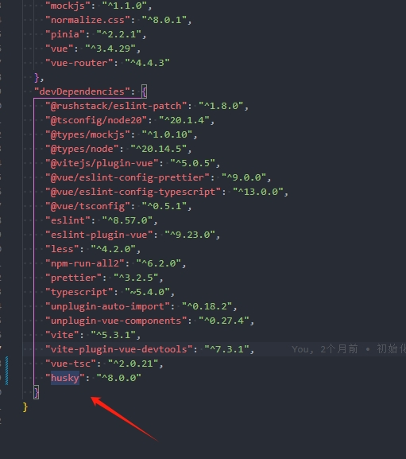
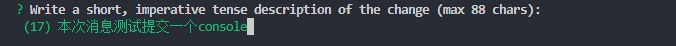
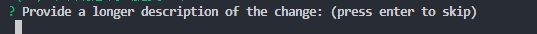
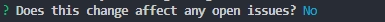

# 代码规范

## 1.1集成editorconfig配置

EditorConfig 有助于为不同 IDE 编辑器上处理同一项目的多个开发人员维护一致的编码风格。

```
# EditorConfig 是一个文件格式，用于定义和维护跨编辑器的编码样式
# http://editorconfig.org
root = true

# 适用于所有文件
[*]
charset = utf-8 #设置文件字符集为 utf-8
indent_style = space #缩进风格(tab | space)
indent_size = 2 #缩进大小
end_of_line = lf #控制换行类型(lf|cr |crlf)
tab_width = 2 #定义用于表示制表符的列数的整数
trim_trailing_whitespace = true # 去除行尾的任意空白字符
insert_final_newline = true # 始终在文件末尾插入一个新行

# 适用于所有 Markdown 文件
[*.md]
indent_size = 4
max_line_length = off
trim_trailing_whitespace = false

# 适用于 JavaScript 文件
[*.js]
indent_size = 2

# 适用于 JSON 文件
[*.json]
indent_size = 2

# 适用于 TypeScript 文件
[*.ts]
indent_size = 2

# 适用于 HTML 文件
[*.html]
indent_size = 2
# 适用于 CSS 文件
[*.css]
indent_size = 2

```

vscode插件


## 1.2使用prettier工具

Prettier 是一款强大的代码格式化工具，支持JavaScript、TypeScript、CSS、SCSS、Less、JSX、Angular、Vue、GraphQL、JSON、Markdown 等语言，基本上前端能用到的文件格式它都可以搞定，是当下最流行的代码格式化工具。

### 1.安装prettier

```
npm install prettier -D
```

### 2.配置.prettierrc文件:

- printWidth:当行字符的长度，推荐80，也有人喜欢100或者120:
- tabWidth:tab是空格的情况下，是几个空格，选择2个:
- useTabs:使用tab缩进还是空格缩进，选择false;
- semi:语句末尾是否要加分号，默认值true，选择false表示不加;
- singleQuote:使用单引号还是双引号，选择true，使用单引号:
- trailingComma:在多行输入的尾逗号是否添加，设置为 none，比如对象类型的最后一个属性后面是否加一个"，":
  - 可选值：
    - `"none"`: 不添加结尾逗号
    - `"es5"`: 只在 ES5 兼容的地方添加（如对象和数组）
    - `"all"`: 在所有可能的地方添加结尾逗号
- bracketSpacing:决定对象字面量的大括号内是否添加空格
- jsxBracketSameLine:在 JSX 中，决定 `>` 是否在最后一行的末尾而不是另起一行。
- arrowParens:决定在箭头函数中是否强制使用括号。
  - 可选值：
    - `"always"`: 总是使用括号
    - `"avoid"`: 只有在必要时使用括号
- endOfLine:决定行结束符的类型。
  - 可选值：
    - `"auto"`: 自动检测
    - `"lf"`: 仅使用换行符（Unix 风格）
    - `"crlf"`: 使用回车和换行符（Windows 风格）
    - `"cr"`: 仅使用回车符

```
{
  "printWidth": 80,
  "tabWidth": 2,
  "useTabs": false,
  "semi": true,
  "singleQuote": true,
  "trailingComma": "es5",
  "bracketSpacing": true,
  "jsxBracketSameLine": false,
  "arrowParens": "always",
  "endOfLine": "lf"
}
```

### 3.创建.prettierignore忽略文件

```
# 忽略所有的构建目录
build/

# 忽略特定文件
src/old-code.js

# 忽略所有的 Markdown 文件
*.md

# 忽略特定的子目录
node_modules/

#项目所需
/dist/*
.loacl
.output.js
/node_modules/**

**/*.svg
**/*.sh
/public/*

```

### 4.vscode安装插件


### 5.测试prettier是否生效

执行代码格式化

- 测试一:在代码中保存代码;
- 测试二:配置一次性修改的命令

在package.json中配置一个scripts:

```
"prettier":"prettier --write ."
```

### 6.VSCod中的配置

settings => editor default format =>选择 prettier -Code formmatter


## 1.3.使用ESLint检测

### 1.在前面创建项目的时候，我们就选择了ESLint，所以Vue会默认帮助我们配置需要的ESLint环境

### 2.VSCode需要安装ESLint插件:


### 3.解决eslint和prettier冲突的问题:

安装插件:(vue在创建项目时，如果选择prettier，那么这两个插件会自动安装)

```
npm install eslint-plugin-prettier eslint-config-prettier -D
```

添加prettier插件:

```
extends: [
    'plugin:vue/vue3-essential',
    'eslint:recommended',
    '@vue/typescript/recommended',
    '@vue/prettier',
    '@vue/prettier/@typescript-eslint',
    'plugin:prettier/recommended'
  ],
```

### 4.VSCode中eslint的配置

```
{
  "eslint.lintTask.enable": true,
  "eslint.alwaysShowStatus": true,
  "eslint.validate": [
    "javascript",
    "javascriptreact",
    "typescript",
    "typescriptreact"
  ]
}

```

## 1.4 git Husky和eslint

虽然我们已经要求项目使用eslint了，但是不能保证组员提交代码之前都将eslint中的问题解决掉了:

- 也就是我们希望保证代码仓库中的代码都是符合eslint规范的;
- 那么我们需要在组员执行 git commit 命令的时候对其进行校验，如果不符合eslint规范，那么自动通过规范进行修复;

那么如何做到这一点呢?可以通过Husky工具:

- husky是一个git hook工具，可以帮助我们触发git提交的各个阶段:pre-commit、commit-msg、pre-push

如何使用husky呢?

这里我们可以使用自动配置命令:

```shell
npx husky-init && npm install
```

这里会做三件事:

### 1.安装husky相关的依赖:



### 2.在项目目录下创建 .husky 文件夹:


### 3.在package.json中添加一个脚本:


接下来，我们需要去完成一个操作:在进行commit时，执行lint脚本: 


这个时候我们执行git commit的时候会自动对代码进行lint校验,

## 1.5.git commit规范

### 1.代码提交风格(为了git提交每次提交的信息规范)

通常我们的git commit会按照统一的风格来提交，这样可以快速定位每次提交的内容，方便之后对版本进行控制。但是如果每次手动来编写这些是比较麻烦的事情，我们可以使用一个工具:Commitizen

- Commitizen 是一个帮助我们编写规范commit message 的工具;

#### 1.安装Commitizen

```shell
npm install commitizen -D
```

#### 2.安装cz-conventional-changelog，并且初始化cz-conventional-changelog:

```shell
npx commitizen init cz-conventional-changelog --save-dev --save-exact
```

这个命令会帮助我们安装cz-conventional-changelog


并且在package.json中进行配置:


这个时候我们提交代码需要使用` npx cz`:

- 第一步是选择type，本次更新的类型

| Type     | 作用                                                         |
| :------- | ------------------------------------------------------------ |
| feat     | 新增特性 (feature)                                           |
| fix      | 修复 Bug(bug fix)                                            |
| docs     | 修改文档(documentation)                                      |
| style    | 代码格式修改(white-space, formatting, missing semi colons, etc) |
| refactor | 代码重构(refactor)                                           |
| perf     | 改善性能(A code change that improves performance)            |
| test     | 测试(when adding missing tests)                              |
| build    | 变更项目构建或外部依赖(例如 scopes: webpack、gulp、npm等)    |
| ci       | 更改持续集成软件的配置文件和 package 中的 scripts 命令，例如 scopes: Travis,Circle 等 |
| chore    | 变更构建流程或辅助工具(比如更改测试环境)                     |
| revert   | 代码回退                                                     |

进行选择对照上面表格


- 第二步选择本次修改的范围(作用域)


- 第三步选择提交的信息



- 第四步提交详细的描述信息



- 第五步是否是一次重大的更改


- 第六步是否影响某个open issue



我们也可以在scripts中构建一个命令来执行cz:


## 2.代码提交验证

如果我们按照cz来规范了提交风格，但是依然有同事通过 git commit 按照不规范的格式提交应该怎么办呢?

- 我们可以通过commitlint来限制提交;

1.安装@commitlint/config-conventional 和 @commitlint/cli

```shell
npm i @commitlint/config-conventional @commitlint/cli
```

2.在根目录创建commitlint.config.js文件，配置commitlint

```js
module.exports={
  extends:['@commitlint/config-conventional']
}
```

3.使用husky生成commit-msg文件，验证提交信息

```shell
npx husky add .husky/commit-msg "npx --no-install commitlint --edit $1"
```


执行如下命令会报错无法提交会显示此代码行,此时使用`npx cz`

```
git add .
git commit -m "XXX"
```


